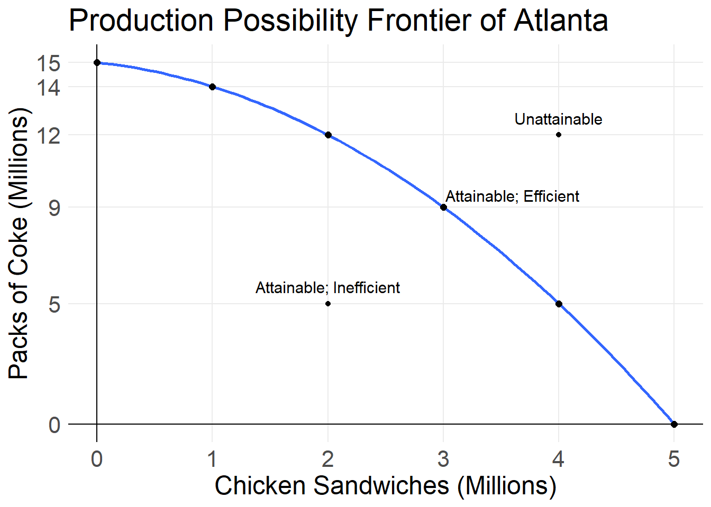
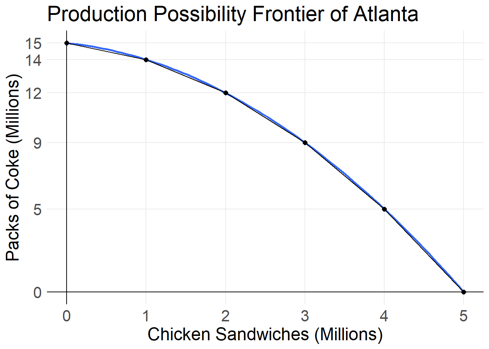
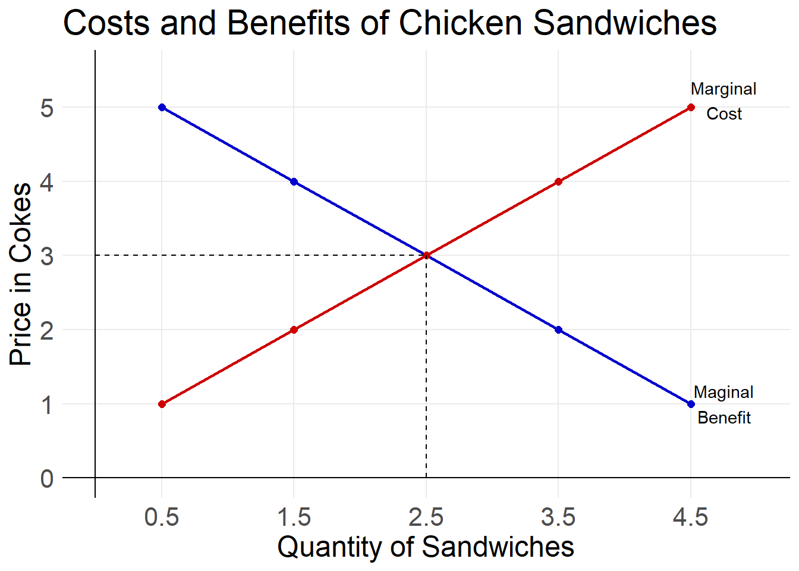

# Opportunity Costs

## Reading 1

### Production Possibility Frontiers

Suppose you have 5 hours of free time tonight. You can choose to either study economics or watch tv. How many hours do you choose to spend watching tv? How many hours to you choose to spend studying economics? How might this choice change if it is a Saturday? What if you have an exam tomorrow? What if it is spring break

All the different possible ways for you to split your 5 hours between studying and watching tv makes up your **production possibility frontier**.

------------------------------------
 Hours Studying   Hours Watching TV
---------------- -------------------
 0                     5
 
 1                     4
 
 2                     3
 
 3                     2
 
 4                     1
 
 5                     0
------------------------------------

Table: Ways to Divide Time Between
Watching TV and Studying

In an economic sense, the **production possibility frontier (PPF)** is the boundary between those combinations of goods and services that can be produced given current technology, and those that cannot.

For your choice between studying economics and watching tv, your PPF would look like this.

For most firms and governments, the production possibility is **non-linear,** or slightly curved. This is because of something called specialization, which we will talk about more next class. For this example let us suppose that the city of Atlanta can produce either Chick-fil-A sandwiches of packs of Coca-Cola. Some of the possible production points are in the table below.

------------------------------------------
 Chicken Sandwiches     Packs of Coke
 (in Millions)         (in Millions)
-------------------- ---------------------
 0                      15
 
 1                      14
 
 2                      12
 
 3                      9
 
 4                      5
 
 5                      0
------------------------------------------

Table: Production Possibilities in Atlanta

We can plot these points on a graph to visualize the production possibility frontier.

Depending on the combination of goods Atlanta wants to produce we can state if it is attainable, unattainable, efficient, or inefficient.

A point of production is **attainable **if the combination of goods can be produced under current technological and resource constraints. A point is **unattainable **if it cannot be produced. A point is **inefficient**, if it can be improved, without having to give up anything. A point is **efficient **if it cannot be improved on. Move the point around on the graph below to see where it is attainable, unattainable, efficient, and inefficient.

Notice that when the point is above the PPF, it is unattainable. When it is below the PPF it is attainable, but it is inefficient.&nbsp; It is inefficient, because we could make more of either one or both of out product, without having to make less of the other. The production is only efficient and attainable when it is *on the PPF*. At this point we cannot make more of one product without reducing production of the other.

### Opportunity and Marginal Cost

Suppose we currently only produce Coca-Cola in Atlanta and produced 15 million packs of Coke per year, what would we have to give up in order to produce chicken sandwiches? We would give up packs of Coke. The cost of coke given up divided by the benefit of chicken sandwiches gained, gives us our **opportunity cost**. The cost of coke given up to produce one more chicken sandwich is the **marginal cost**.

In order to go from no chicken sandwich production to 1 million chicken sandwiches we must give up 1 million packs of Coke. So the opportunity (and marginal) cost is 1/1 = 1. The table below shows how to calculate the opportunity costs as we increase chicken sandwich production.

--------------------------------------------------------------------------------
 Number of       Number of         Midpoint of            Opportunity 
 Sandwiches      Cokes             Sandwiches             Cost
------------- ------------- ------------------------- --------------------------
 0                15
 
                             $\frac{0+1}{2}$            $\frac{1}{1} = 1$
                             $= \frac{1}{2}$
                             $= 0.5$
                             
 1               14
 
                             $\frac{1+2}{2}$            $\frac{2}{1} = 2$
                             $= \frac{3}{2}$
                             $= 1.5$
                             
 2               12
 
                             $\frac{2+3}{2}$            $\frac{3}{1} = 3$
                             $= \frac{5}{2}$
                             $= 2.5$
                            
 3               9
 
                             $\frac{3+4}{2}$            $\frac{4}{1} = 4$
                             $= \frac{7}{2}$
                             $= 3.5$
                             
 4               5 
 
                             $\frac{4+5}{2}$            $\frac{5}{1} = 5$
                             $= \frac{9}{2}$
                             $= 4.5$
                             
 5               0
--------------------------------------------------------------------------------

Table: Opportunity Costs of Producing More Sandwiches

Notice the column "Midpoint of Sandwiches". Because the PPF is curved, the slope between 1 and 2 chicken sandwiches is not a straight line. This also means that the opportunity cost between these two points is not constant at 2 packs of coke, but rather is also moving. Instead, the opportunity cost that we calculated is the opportunity cost between 1 and 2 million chicken sandwiches. So we know that the opportunity cost halfway between 1 and 2 million sandwiches (the midpoint) is 2 packs of coke.

Midpoint Formula = (sum of two points)/2

## Exercises 1

## Reading 2

### Using Resources Efficiently
Above we saw that we can produce at any point on our PPF and it is efficient. Specifically that point is **productively efficient**. However, we have not determined which of the infinite options on the PPF is the point we should actually choose to operate at. The optimal point is the one that most efficiently *allocates our resources*. Specifically we are looking for the point of **allocative efficiency**: the point where goods and services are produced at the *lowest possible cost* and in the quantities that provide the *greatest possible benefit*. We found the cost of producing more chicken sandwiches in terms of packs of Coke in the table above. If we also know the additional benefit, or the amount of Coke's consumers are willing to give up in order to purchase more chicken sandwiches, we can determine the point of allocative efficiency.

Suppose that the marginal benefits of a chicken sandwich (The amount of Coke consumers are willing to give up to receive one more sandwich) are what is in the table below.

----------------------------------------------------
 Quantity of     Marginal Cost    Marginal Benefit
  Sandwiches     in Cokes         in Cokes
-------------- ---------------- --------------------
 0.5            1                5
 
 1.5            2                4
 
 2.5            3                3
 
 3.5            4                2
 
 4.5            5                1
----------------------------------------------------

Table: Marginal Costs and Benefits of More
Sandwiches

If we chose to produce 0.5 Chicken sandwiches, the marginal costs are the lowest and the marginal benefits are the highest. But remember Marginal is not total, it is only the amount for the very next unit. We want the lowest total costs and highest total benefits. The rule is that if marginal benefit is *greater* than marginal cost, then more production improves the efficiency. If the marginal benefit is* less* than marginal cost, then production should reduce to improve efficiency. The point where we do not want to increase or decrease production is when marginal benefit and marginal costs are **equal**. The point of allocative efficiency is 2.5 million chicken sandwiches because the marginal cost and marginal benefit are both 3.
We can also graph the marginal costs and marginal benefit curves to help visualize the point of allocative efficiency. Graphically it is the point where the curves intersect.

## Exercises 2
